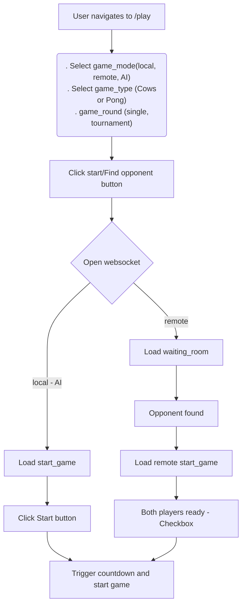

```mermaid


flowchart TD
  A[User navigates to /play] --> B(". Select game_mode(local, remote, AI)<br> . Select game_type (Cows or Pong)<br> . game_round (single, tournament)")

  B --> E[Click start/Find opponent button]
  

  E --> F{Open websocket}
  
  F -->|local - AI| G[Load start_game]
  F -->|remote| H[Load waiting_room ]
  
  H --> I[Opponent found] --> J[Load remote start_game ]

  G --> K[Click Start button]
  J --> L[Both players ready - Checkbox]

  K --> M[Trigger countdown and start game]
  L --> M


```