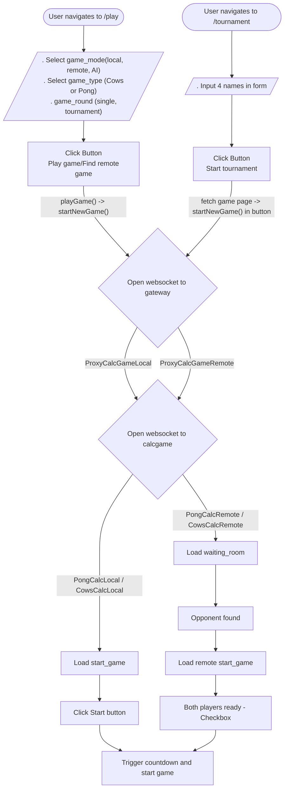

```mermaid


flowchart TD
  A([User navigates to /play]) --> B[/". Select game_mode(local, remote, AI)<br> . Select game_type (Cows or Pong)<br> . game_round (single, tournament)"/]

  B --> E[Click Button<br> Play game/Find remote game]
  

  E -->|"playGame() -> startNewGame()"| F{Open websocket to gateway}
  
  F -->|ProxyCalcGameLocal| F2{Open websocket to calcgame}
  F -->|ProxyCalcGameRemote| F2{Open websocket to calcgame}

  F2 -->|PongCalcLocal / CowsCalcLocal| G[Load start_game]
  F2 -->|PongCalcRemote / CowsCalcRemote| H[Load waiting_room ]
  
  H --> I[Opponent found] --> J[Load remote start_game ]

  G --> K[Click Start button]
  J --> L[Both players ready - Checkbox]

  K --> M[Trigger countdown and start game]
  L --> M


  P([User navigates to /tournament]) --> Q[/". Input 4 names in form"/]
  Q --> R[Click Button<br> Start tournament]
  R -->|"fetch game page -> startNewGame() in button"| F

```