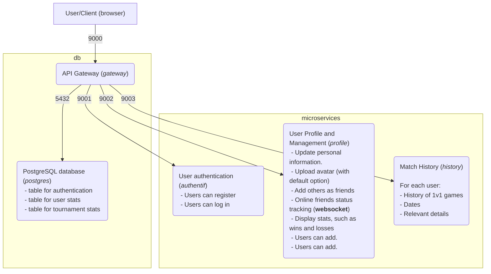

```mermaid
flowchart TB
A["User/Client (browser)"] -->|9000| B("API Gateway (<i>gateway</i>)")

  subgraph db
    direction RL
    style C text-align:left
    B -->|5432| C("PostgreSQL database (<i>postgres</i>)<br> - table for authentication<br> - table for user stats<br> - table for tournament stats")
  end

  subgraph microservices
    direction TB
      style D text-align:left
      style E text-align:left
      style F text-align:left

      B -->|9001| D("User authentication (<i>authentif</i>)<br> - Users can register<br> - Users can log in")

      B -->|9002| E("User Profile and Management (<i>profile</i>)<br> - Update personal information.<br> - Upload avatar (with default option)<br> - Add others as friends<br> - Online friends status tracking (<b>websocket</b>)<br> - Display stats, such as wins and losses<br> - Users can add.<br> - Users can add.")

      B -->|9003| F("Match History (<i>history</i>)<br>
      For each user:<br> - History of 1v1 games<br> - Dates<br> - Relevant details")

  end
``` 